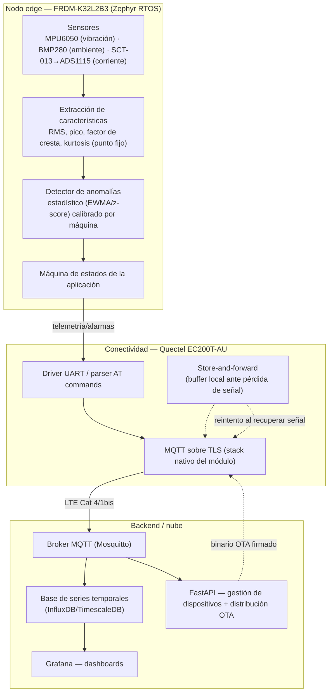

# Arquitectura

## Vista general (3 capas)



## Mapeo de sensores a periféricos

| Sensor | Modelo | Bus/pines | Uso | Estado |
|---|---|---|---|---|
| Vibración (IMU) | MPU6050 | I2C0 (PTB2/PTB3, compartido con BMP280) | Acelerómetro 3 ejes → RMS/pico/kurtosis de vibración | Pendiente (Fase 2) |
| Ambiental | BMP280 | I2C0, addr `0x76` | Temperatura + presión (contexto, no dispara alarmas por sí solo) | Driver heredado, requiere verificación (ver nota abajo) |
| Corriente | SCT-013 → ADS1115 | I2C0, ADS1115 addr `0x48` | Corriente AC no invasiva del motor → RMS de corriente | Driver heredado, requiere verificación |
| Almacenamiento local | W25Q32 (flash SPI) | SPI1 (PTD5 SCK, PTB16 MOSI, PTB17 MISO, PTD4 CS) | Store-and-forward de telemetría + datos de calibración | Driver custom heredado, requiere revisión (ver nota) |
| Conectividad celular | Quectel EC200T-AU | LPUART1 (libre; LPUART0 está tomado por la consola de depuración) | AT commands, MQTT/TLS | Fase 4 |

**Nota sobre el código heredado**: el devicetree actual declara el BMP280 como
`compatible = "bosch,bme280"` (el driver de BME280, que espera también el
sensor de humedad). Un BMP280 real no tiene ese registro, lo que puede
explicar por qué "no responde" incluso con el sensor bien cableado — es una
hipótesis a verificar en la Fase 2, no un hecho confirmado todavía. El driver
SPI (`spi_kinetis.c`) tampoco usa la API estándar de SPI de Zephyr, sino
registros directos del periférico — candidato a reemplazar por el driver
nativo de Zephyr si existe soporte para este SoC. Ver también la nota de
memoria sobre la referencia funcional en MCUXpresso.

## Por qué I2C0 compartido para tres dispositivos

BMP280, ADS1115 y (próximamente) MPU6050 comparten el mismo bus I2C0 —
direcciones por defecto sin conflicto (`0x76`, `0x48`, `0x68`). Esto es
representativo de un nodo real: no sobran buses I2C en un MCU tan pequeño, así
que el firmware debe manejar bien la recuperación del bus ante un dispositivo
que se cuelgue (el log de arranque ya muestra lógica de recuperación de I2C
heredada — `[RECOVERY] Verificando estado físico del bus...`).

## Presupuesto de memoria (medido, no estimado)

Con el firmware base actual (sensores + threads, sin conectividad ni detección
de anomalías todavía):

```
FLASH: 42264 B / 256 KB  (16.12%)
RAM:   20108 B / 32 KB   (61.36%)
```

El RAM es la restricción más apretada. Cada fase que agregue funcionalidad
debe volver a medir con `west build -t ram_report` antes de darse por
terminada.
