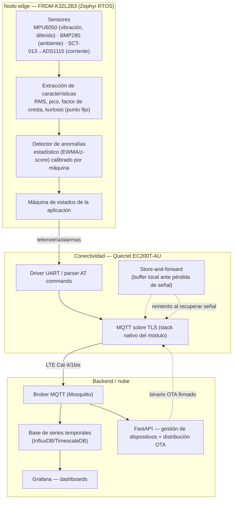

# Arquitectura

## Vista general (3 capas)



## Mapeo de sensores a periféricos

| Sensor | Modelo | Bus/pines | Uso | Estado |
|---|---|---|---|---|
| Vibración (IMU) | MPU6050 (o el **FXOS8700 integrado en la placa**, ver nota) | I2C1 (PTC1/PTC2) / I2C0 `0x1C` para el FXOS8700 | Acelerómetro 3 ejes → RMS/pico/kurtosis de vibración | **Diferido** — fuera del alcance actual, no descartado (ver `00-product-spec.md`) |
| Ambiental | BMP280 | I2C1, addr `0x76` | Temperatura + presión (contexto, no dispara alarmas por sí solo) | **Implementado y validado en hardware real** (`chip_id=0x58`) |
| Corriente | SCT-013 → ADS1115 | I2C1 (PTC1 SCL / PTC2 SDA), ADS1115 addr `0x48` | Corriente AC no invasiva del motor → RMS de corriente | **Implementado y validado en hardware real** (`ADS1115 OK`) |
| Almacenamiento local | W25Q32 (XMC, 4 MB) | SPI1 (PTD5 SCK, PTB16 MOSI, PTB17 MISO, PTD4 CS) | Store-and-forward de telemetría + datos de calibración | **Validado en hardware** (JEDEC `20 40 16`). Driver custom, fuera de la API estándar de Zephyr (ver ADR-002). **Limitación de desgaste sin resolver — ver `04-almacenamiento-local.md`** |
| Conectividad celular | Quectel EC200T-AU | LPUART1 (libre; LPUART0 está tomado por la consola de depuración) | AT commands, MQTT/TLS | Fase 4 |

**Nota sobre el código heredado (actualizada tras auditoría en Fase 2)**: la
hipótesis original — que el devicetree declarara el BMP280 como
`compatible = "bosch,bme280"` causaba el "no responde" — **se descartó**. Ese
nodo del devicetree es código muerto: `CONFIG_SENSOR`/`CONFIG_BME280` nunca se
habilitan en `prj.conf`, así que el driver nativo de Zephyr ni se compila. El
sensor se lee con un driver propio (`drivers/bmp280.c`) que habla I2C directo
y valida correctamente `chip_id == 0x58` (el ID real del BMP280). El nodo
`bmp280@76` se eliminó del overlay por ser ruido engañoso, no una
configuración real. El "no responde" observado se debe simplemente a que el
sensor no estaba cableado en la prueba.

El driver de ADS1115/SCT-013 (`drivers/ads1115.c`) está implementado y
validado en hardware real (port del firmware funcional de MCUXpresso, con las
correcciones de la API de Zephyr — ver PR #4). El ADS1115 responde en `0x48`
sobre I2C1 y el arranque reporta `ADS1115 OK`.

El driver SPI (`spi_kinetis.c`) usa registros directos del periférico en vez
de la API estándar de SPI de Zephyr — **decisión documentada en ADR-002**:
Zephyr no tiene un driver nativo para el periférico SPI simple de esta familia
Kinetis (solo soporta el periférico DSPI de otros modelos), así que no es
deuda técnica evitable, es la única opción funcional disponible. Ver ADR-002
para el detalle y la mejora identificada (migrar el muxeo de pines al
subsistema `pinctrl` de Zephyr sin tocar la lógica de transferencia).

## Por qué I2C1 (PTC1/PTC2) y no I2C0 (PTB2/PTB3)

Los sensores del proyecto cuelgan de **I2C1 sobre PTC1 (SCL) y PTC2 (SDA)** —
los pines `A5`/`A4` del header de la FRDM-K32L2B3, que son los pines I2C
**designados por NXP** para esta placa.

La configuración original usaba I2C0 remuxeado a `PTB2`/`PTB3`, y ningún
sensor respondía. Un bring-up sistemático (proyecto mínimo aparte, una
variable por etapa, con el FXOS8700 integrado de la placa como control
positivo) demostró que Zephyr, el SDK, el driver `i2c_mcux`, el board port y
el propio ADS1115 estaban sanos: el fallo era exclusivo de esos dos pines.
**ADR-003** documenta la investigación completa, incluidos los diagnósticos
intermedios que resultaron incorrectos.

Direcciones sin conflicto en el bus (`0x76` BMP280, `0x48` ADS1115). Compartir
un solo bus entre varios sensores es representativo de un nodo real: no sobran
buses I2C en un MCU tan pequeño.

**I2C0 queda libre** en su configuración de fábrica, con el acelerómetro/
magnetómetro **FXOS8700 soldado en la placa** accesible en `0x1C` y soportado
nativamente por Zephyr. Es un candidato directo para el sensor de vibración
diferido, sin hardware adicional.

## Presupuesto de memoria (medido, no estimado)

Con el firmware actual (sensores BMP280+ADS1115, threads, detector de
anomalías por z-score y el shell de Zephyr habilitado, sin conectividad
todavía):

```
FLASH: 76160 B / 256 KB  (29.05%)
RAM:   25068 B / 32 KB   (76.50%)
```

El salto respecto a la medición anterior (42580 B / 20108 B) viene casi
entero de habilitar `CONFIG_SHELL` + `CONFIG_I2C_SHELL`, que se agregaron
como herramienta de diagnóstico durante el bring-up de I2C (ADR-003) y
resultaron decisivos: el comando nativo `i2c scan` fue lo que permitió
descartar el código propio como causa. Se mantienen porque siguen siendo
útiles para validación en hardware (HIL), pero **son los primeros candidatos
a eliminar** cuando el RAM apriete en la Fase 6 (MCUboot/OTA).

El RAM es la restricción más apretada. Cada fase que agregue funcionalidad
debe volver a medir con `west build -t ram_report` antes de darse por
terminada.
