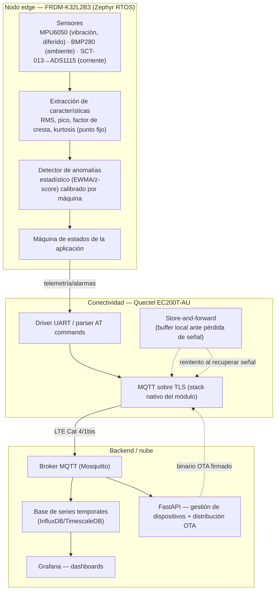

# Arquitectura

## Vista general (3 capas)



## Mapeo de sensores a periféricos

| Sensor | Modelo | Bus/pines | Uso | Estado |
|---|---|---|---|---|
| Vibración (IMU) | MPU6050 | I2C0 (PTB2/PTB3, compartido con BMP280) | Acelerómetro 3 ejes → RMS/pico/kurtosis de vibración | **Diferido** — fuera del alcance actual, no descartado (ver `00-product-spec.md`) |
| Ambiental | BMP280 | I2C0, addr `0x76` | Temperatura + presión (contexto, no dispara alarmas por sí solo) | Implementado y validado en hardware real |
| Corriente | SCT-013 → ADS1115 | I2C0, ADS1115 addr `0x48` | Corriente AC no invasiva del motor → RMS de corriente | Implementado y validado en hardware real (falta cablear el sensor físico) |
| Almacenamiento local | W25Q32 (flash SPI) | SPI1 (PTD5 SCK, PTB16 MOSI, PTB17 MISO, PTD4 CS) | Store-and-forward de telemetría + datos de calibración | Driver custom funcional, fuera de la API estándar de Zephyr (ver nota) |
| Conectividad celular | Quectel EC200T-AU | LPUART1 (libre; LPUART0 está tomado por la consola de depuración) | AT commands, MQTT/TLS | Fase 4 |

**Nota sobre el código heredado (actualizada tras auditoría en Fase 2)**: la
hipótesis original — que el devicetree declarara el BMP280 como
`compatible = "bosch,bme280"` causaba el "no responde" — **se descartó**. Ese
nodo del devicetree es código muerto: `CONFIG_SENSOR`/`CONFIG_BME280` nunca se
habilitan en `prj.conf`, así que el driver nativo de Zephyr ni se compila. El
sensor se lee con un driver propio (`drivers/bmp280.c`) que habla I2C directo
y valida correctamente `chip_id == 0x58` (el ID real del BMP280). El nodo
`bmp280@76` se eliminó del overlay por ser ruido engañoso, no una
configuración real. El "no responde" observado se debe simplemente a que el
sensor no estaba cableado en la prueba.

El driver de ADS1115/SCT-013 (`drivers/ads1115.c`) ya está implementado y
validado en hardware real (port del firmware funcional de MCUXpresso, con las
correcciones de la API de Zephyr — ver PR #4); falta cablear el sensor físico
de corriente para la validación funcional completa.

El driver SPI (`spi_kinetis.c`) usa registros directos del periférico en vez
de la API estándar de SPI de Zephyr — **decisión documentada en ADR-002**:
Zephyr no tiene un driver nativo para el periférico SPI simple de esta familia
Kinetis (solo soporta el periférico DSPI de otros modelos), así que no es
deuda técnica evitable, es la única opción funcional disponible. Ver ADR-002
para el detalle y la mejora identificada (migrar el muxeo de pines al
subsistema `pinctrl` de Zephyr sin tocar la lógica de transferencia).

## Por qué I2C0 compartido para tres dispositivos

BMP280, ADS1115 y (si se retoma más adelante) MPU6050 comparten el mismo bus I2C0 —
direcciones por defecto sin conflicto (`0x76`, `0x48`, `0x68`). Esto es
representativo de un nodo real: no sobran buses I2C en un MCU tan pequeño, así
que el firmware debe manejar bien la recuperación del bus ante un dispositivo
que se cuelgue (el log de arranque ya muestra lógica de recuperación de I2C
heredada — `[RECOVERY] Verificando estado físico del bus...`).

## Presupuesto de memoria (medido, no estimado)

Con el firmware base actual (sensores BMP280+ADS1115 reales + threads, sin
conectividad ni detección de anomalías todavía):

```
FLASH: 42580 B / 256 KB  (16.24%)
RAM:   20108 B / 32 KB   (61.36%)
```

El RAM es la restricción más apretada. Cada fase que agregue funcionalidad
debe volver a medir con `west build -t ram_report` antes de darse por
terminada.
