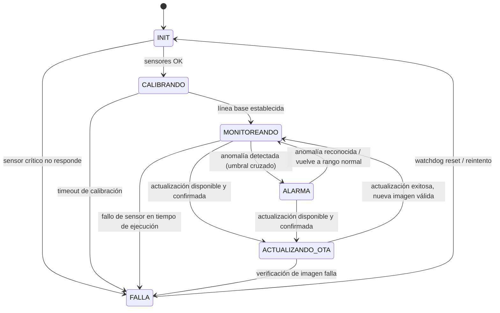

# Máquina de estados del firmware

## Diagrama

## Estados

| Estado | Qué hace | Qué NO hace |
|---|---|---|
| **INIT** | Inicializa drivers (I2C, SPI, ADC, UART), verifica presencia de sensores críticos (vibración, corriente), recupera configuración de calibración desde flash si existe | No muestrea ni transmite todavía |
| **CALIBRANDO** | Toma una ventana de muestras de referencia (vibración/corriente) para establecer la línea base estadística de la máquina específica | No genera alarmas — no hay línea base aún con qué compararse |
| **MONITOREANDO** | Muestrea periódicamente, calcula características, compara contra la línea base, publica telemetría periódica vía MQTT (si hay conexión) o la guarda en store-and-forward | No debería quedarse bloqueado si el módulo celular no responde — el muestreo/detección es independiente de la conectividad |
| **ALARMA** | Igual que MONITOREANDO pero además publica el evento de alarma con prioridad, y mantiene el estado hasta que la lectura vuelva a rango o se reconozca manualmente | No dejar de muestrear mientras está en alarma — se sigue necesitando ver la evolución |
| **ACTUALIZANDO_OTA** | Recibe la imagen nueva vía celular, la escribe al slot secundario de MCUboot, dispara el swap y reinicia | No debe interrumpir una alarma activa sin antes reportarla — idealmente se pospone la actualización si hay una alarma en curso, salvo que sea forzada |
| **FALLA** | Estado seguro: deja de intentar operaciones que fallaron repetidamente, reporta el fallo si hay conectividad, espera reset por watchdog | No debe re-intentar en bucle apretado — hay backoff antes de volver a INIT |

## Decisiones de diseño

- **El muestreo/detección nunca depende de la conectividad**: MONITOREANDO y
  ALARMA funcionan igual con o sin señal celular — la diferencia es si el dato
  se publica de inmediato o se guarda en store-and-forward (FR5 del product
  spec). Esto refleja el problema real: la máquina no dejará de tener una
  falla mecánica solo porque se cayó la señal.
- **ACTUALIZANDO_OTA es alcanzable desde ALARMA**: en la vida real no se puede
  asumir que las actualizaciones solo llegan cuando todo está tranquilo: hay
  que decidir explícitamente si se pospone o se fuerza (a definir en Fase 6,
  por ahora el diagrama deja la transición abierta).
- **FALLA vuelve a INIT, no es un estado terminal**: un nodo remoto sin acceso
  físico no puede depender de que alguien lo reinicie a mano; el watchdog
  hardware es el mecanismo de recuperación de último recurso.
